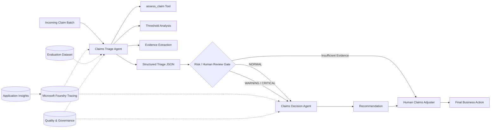

# ClaimSight — Multi-Agent Insurance Claims Decision Support

> **Microsoft Foundry Agent Architect / Level 3 project**
>
> A production-oriented, multi-agent claims processing system built with Microsoft Foundry, Azure AI Projects SDK, Azure Monitor/Application Insights, structured agent contracts, systematic evaluation, and workflow orchestration.


---

## 1. Project Overview

**ClaimSight** is an insurance claims decision-support platform for property and auto claims.

The system receives claim evidence such as:

- document completeness
- damage-vs-estimate consistency
- fraud risk score
- policy coverage match
- submitted documents

It then uses **two specialized AI agents**:

1. **Claims Triage Agent**
   - evaluates claim evidence against explicit thresholds
   - identifies out-of-range metrics
   - summarizes supporting evidence
   - identifies missing documentation
   - classifies risk as **NORMAL / WARNING / CRITICAL**
   - determines whether **human review is required**

2. **Claims Decision Agent**
   - consumes the structured output produced by Triage
   - recommends **APPROVE / REQUEST DOCUMENTS / INVESTIGATE / DENY**
   - provides confidence, reasoning, urgency, next steps, and the human-review requirement
   - does **not** make an autonomous final insurance determination

The final business authority remains with a **human claims adjuster**.

---

## 2. Why a Multi-Agent Architecture?

A single large prompt could technically perform the whole task, but ClaimSight intentionally separates the responsibilities.

### Claims Triage Agent = Evidence & Risk

The Triage Agent is responsible for:

- evidence collection
- threshold comparison
- anomaly detection
- missing-document identification
- risk classification
- escalation detection

### Claims Decision Agent = Recommendation

The Decision Agent receives only the structured triage evidence and is responsible for:

- interpreting the triage result
- selecting an operational recommendation
- providing rationale
- preserving human-review requirements

This separation improves:

- **responsibility boundaries**
- **debuggability**
- **observability**
- **evaluation**
- **maintainability**
- **human oversight**
- **future replacement of individual agents**

---

# 3. System Architecture

## End-to-End Flow



## Architecture Image

The repository also contains the scenario architecture artwork:


### Core Information Flow

```text
Incoming claim batch
        |
        v
Claims Triage Agent
  |-- assess_claim
  |-- threshold checks
  |-- evidence extraction
  |-- risk classification
  |-- human-review detection
        |
        v
Structured Triage JSON
        |
        v
Risk / Human Review Gate
        |
        +----------------------+
        |                      |
        v                      v
Decision Agent             Human Adjuster
        |                      ^
        v                      |
Recommendation ---------------+
        |
        v
Final business action
```

---

# 4. Agent Responsibilities

## 4.1 Claims Triage Agent

### Inputs

The Triage Agent can operate in two supported contexts.

**Tool-backed production workflow**

When a request contains claim IDs without the full claim evidence, the agent uses the `assess_claim` FunctionTool to retrieve claim metrics and thresholds from the lab data source.

**Direct-evidence workflow**

When complete claim metrics, percentages, documents, and evidence are supplied directly, the agent uses that evidence without calling the local Python tool.

### Thresholds

The current ClaimSight demo thresholds are:

| Metric | Rule |
|---|---:|
| Completeness | >= 80 |
| Damage vs estimate match | >= 70 |
| Fraud risk score | <= 50 |
| Policy coverage match | >= 85 |

`N/A` means the metric is unavailable and must not be invented.

### Risk Classification

- **NORMAL** — no material threshold violations
- **WARNING** — one or more issues require follow-up
- **CRITICAL** — high fraud risk, multiple significant violations, or combined evidence indicating material claim risk

### Human Review

Human review is required when:

- fraud risk is above its threshold
- multiple significant metrics are outside thresholds
- evidence is insufficient for a reliable recommendation

---

## 4.2 Claims Decision Agent

The Decision Agent consumes the structured Triage output rather than independently re-reading or inventing claim evidence.

Possible recommendations:

- **APPROVE**
- **REQUEST DOCUMENTS**
- **INVESTIGATE**
- **DENY**

Every recommendation preserves the triage agent's:

- claim ID
- risk level
- confidence
- evidence
- missing-document information
- human-review requirement

The output is a recommendation for a human adjuster, not a final autonomous adjudication.

---

# 5. Structured Agent Contract

The Triage Agent returns one JSON object per claim inside a single JSON array.

Example:

```json
[
  {
    "claim_id": "CLM-001",
    "risk_level": "CRITICAL",
    "confidence": 0.96,
    "flagged_metrics": [
      {
        "metric": "fraud_risk_score",
        "value": 82,
        "threshold": 50,
        "direction": "above"
      },
      {
        "metric": "damage_vs_estimate_match",
        "value": 52,
        "threshold": 70,
        "direction": "below"
      }
    ],
    "missing_documents": [],
    "evidence_summary": "Fraud risk is above threshold and damage-to-estimate consistency is below threshold.",
    "human_review_required": true
  }
]
```

The production Python workflow validates this structure before routing claims to the Decision Agent.

This creates a clear machine-readable boundary between:

**Evidence → Risk Assessment → Recommendation**

---

# 6. Grounding and Evidence Strategy

ClaimSight follows an explicit evidence hierarchy.

### Primary evidence

- tool-returned claim metrics
- tool-returned thresholds
- structured claim records supplied to the agent

### Secondary guidance

The repository contains:

[`claims/knowledge/CLAIMSIGHT_DEMO_GUIDANCE.md`](./claims/knowledge/CLAIMSIGHT_DEMO_GUIDANCE.md)

This is **demo guidance**, not a real insurance policy or legal/regulatory source.

### Important safeguards

The agents must:

- preserve supplied metric values
- avoid inventing claim facts
- avoid inventing policy terms
- surface missing or conflicting evidence
- avoid trusting the source `status` field as the final truth
- preserve human review requirements

A production deployment should replace or supplement the demo data with governed sources such as:

- policy systems
- claims history
- fraud intelligence services
- document-management systems
- approved coverage rules
- regulatory/compliance guidance

---

# 7. Observability

ClaimSight implements the **Monitor** stage of the AI lifecycle using Microsoft Foundry tracing and Azure Monitor/Application Insights.

The monitoring path captures:

- agent invocations
- model calls
- tool calls
- latency
- token consumption
- errors
- workflow execution
- agent-level traces

### Why tracing matters

For a claims workflow, it should be possible to investigate:

> What evidence did the agent receive, what tool did it call, what did it produce, and why was the claim routed?

The repository's Challenge 2 implementation instruments the real Triage → Decision path.

---

# 8. Evaluation

ClaimSight uses systematic evaluation rather than relying only on manual inspection.

## Dataset

The evaluation dataset contains **10 representative claim scenarios** covering:

- normal claims
- missing/incomplete evidence
- elevated fraud risk
- damage-estimate inconsistency
- weak coverage match
- combined risk indicators

Dataset:

[`claims/challenge-3-evaluate/eval_portal.jsonl`](./claims/challenge-3-evaluate/eval_portal.jsonl)

A second structured evaluation reference is available at:

[`claims/challenge-4-deploy/evaluation_dataset.json`](./claims/challenge-4-deploy/evaluation_dataset.json)

## Foundry Evaluation

The portal evaluation uses:

- **Coherence**
- **Fluency**

The evaluation-safe agent version was intentionally created **without local Python tools**, because the Foundry portal evaluation environment cannot execute the local `assess_claim` FunctionTool.

Evaluation-safe creation script:

[`claims/challenge-3-evaluate/create_eval_agent.py`](./claims/challenge-3-evaluate/create_eval_agent.py)

### Submission validation snapshot

The latest successful Foundry evaluation run for the evaluation-safe agent recorded:

- **Overall: 100%**
- **Coherence: 10/10**
- **Fluency: 10/10**
- **10/10 rows passed for both evaluators**

The key lesson from the evaluation work was that **agent execution and agent quality are different concerns**. Monitoring can show that the system ran successfully; evaluation checks whether the produced response is actually coherent and appropriate for the input.

---

# 9. Production Workflow

Challenge 4 turns the two agents into an executable multi-agent pipeline.

## Python orchestration

The primary flow is:

```text
ensure_agents_deployed()
        |
        v
run_claims_triage()
        |
        v
_validate structured triage output
        |
        v
route flagged / human-review claims
        |
        v
run_claims_decision()
        |
        v
print_claims_report()
```

Implementation:

[`claims/challenge-4-deploy/deploy.py`](./claims/challenge-4-deploy/deploy.py)

## Foundry Workflow Agent

A persistent workflow named:

**`claims-processing-workflow`**

was created in Microsoft Foundry and contains:

```text
Claims Triage Agent
        ↓
Claims Decision Agent
        ↓
End
```

The workflow is visible under:

**Microsoft Foundry → Build → Agents → Workflows**

---

# 10. Human-in-the-Loop Governance

ClaimSight is intentionally a **decision-support system**.

The architecture does not give the model unchecked authority to finalize a claim.

### Escalation examples

A claim is retained for human review when:

- fraud risk is materially elevated
- several indicators are outside thresholds
- documentation is incomplete
- evidence is insufficient
- recommendation consequences are material

The system preserves:

```text
human_review_required = true
```

through the agent handoff.

This allows a human adjuster to review the evidence before a real business action is taken.

---

# 11. Repository Structure

```text
FrontierWeekHack/
│
├── README.md
│
└── claims/
    ├── README.md
    ├── ARCHITECTURE.md
    ├── EVALUATION_PLAN.md
    │
    ├── knowledge/
    │   └── CLAIMSIGHT_DEMO_GUIDANCE.md
    │
    ├── challenge-0-setup/
    │   ├── README.md
    │   └── ...
    │
    ├── challenge-1-build/
    │   ├── README.md
    │   ├── agents.py
    │   ├── claims_data.json
    │   └── ...
    │
    ├── challenge-2-monitor/
    │   ├── README.md
    │   ├── monitor.py
    │   └── ...
    │
    ├── challenge-3-evaluate/
    │   ├── README.md
    │   ├── eval_portal.jsonl
    │   └── create_eval_agent.py
    │
    └── challenge-4-deploy/
        ├── README.md
        ├── deploy.py
        └── evaluation_dataset.json
```

---

# 12. Running the Project

## Prerequisites

- Azure subscription
- Microsoft Foundry project
- Azure CLI
- Python 3.10+
- Git / GitHub
- Azure authentication with sufficient Foundry permissions

## Configure environment

Create the environment file required by the challenge setup.

Typical configuration:

```env
PROJECT_CONNECTION_STRING=<your-project-connection-string>
MODEL_DEPLOYMENT_NAME=<your-model-deployment>
```

Do not commit secrets.

## Challenge 1 — Build the agents

```bash
cd claims/challenge-1-build
python agents.py
```

## Challenge 2 — Monitoring

```bash
cd claims/challenge-2-monitor
python monitor.py
```

Then inspect traces in Microsoft Foundry / Azure Monitor / Application Insights.

## Challenge 3 — Evaluation

Create the Foundry evaluation from:

**Build → Evaluations → Create**

Target:

**Agent → `claims-triage-agent`**

Use the provided evaluation dataset and the built-in Coherence and Fluency evaluators.

## Challenge 4 — Production workflow

```bash
cd claims/challenge-4-deploy
python deploy.py
```

This performs:

1. agent deployment/version publication
2. Triage execution
3. structured-result validation
4. Decision routing
5. consolidated report generation
6. Foundry workflow publication
7. workflow invocation

---

# 13. Demonstrated End-to-End Result

A representative Challenge 4 run processes five claims.

The workflow demonstrated:

```text
5 claims assessed
        ↓
3 claims requiring routing
        ↓
Decision Agent invoked for:
  CLM-001
  CLM-003
  CLM-005
        ↓
Consolidated claims report
```

The production workflow also generated a Foundry workflow response successfully through the Responses API.

---

# 14. Microsoft Foundry Assets

The project uses these core Foundry assets:

| Asset | Purpose |
|---|---|
| `claims-triage-agent` | Claim evidence and risk triage |
| `claims-decision-agent` | Decision-support recommendation |
| `claims-processing-workflow` | Multi-agent orchestration |
| Foundry Evaluation | Quality measurement |
| Foundry Tracing | Operational observability |
| Application Insights | Trace analysis and diagnostics |

At the current submission snapshot, the portal shows the persistent Triage and Decision agents as running and the workflow under **Build → Agents → Workflows**.

---

# 15. Engineering Decisions

The core architectural decisions behind ClaimSight are:

### 1. Tool-grounded evidence

Use deterministic claim data and threshold calculations instead of asking the model to invent measurements.

### 2. Specialized agents

Separate risk analysis from recommendation generation.

### 3. Structured contracts

Use machine-readable JSON between agents.

### 4. Human oversight

Keep final authority with a human adjuster.

### 5. Observability

Trace agent, tool, model, and workflow execution.

### 6. Evaluation

Use a repeatable dataset and LLM-as-judge evaluation before promoting changes.

### 7. Clear lab/production boundary

The local `assess_claim` function is a lab tool boundary. Production implementations can replace it with authenticated enterprise tools without changing the agent architecture.

---

# 16. Production Evolution

The current implementation is intentionally a hackathon / reference architecture.

A production version could add:

### Enterprise tools

- `fetch_policy`
- `check_fraud_database`
- `fetch_claim_history`
- `request_documents`
- `verify_coverage`
- payment / settlement verification

### Knowledge grounding

Connect governed policy and claims-procedure documents through a managed knowledge source.

### Better routing

Add:

- high-value claim routing
- senior-adjuster escalation
- ambiguous-risk thresholds
- parallel claim processing
- SLA-aware prioritization

### Stronger evaluation

Extend the current evaluation suite with:

- Groundedness
- Task adherence
- Relevance
- Safety / governance
- Tool-call correctness
- structured-output contract tests
- end-to-end workflow tests
- regression datasets
- CI/CD release gates

### Deployment targets

The Python workflow can be wrapped in:

- Azure Container Apps
- Azure App Service
- Azure Functions
- API-based claims intake services
- event-driven document-processing pipelines

---

# 17. Known Design Boundary

The current project is a **decision-support prototype**, not an actual insurance adjudication engine.

The repository's demo guidance is not intended to represent:

- a real insurance policy
- binding underwriting rules
- legal advice
- regulatory requirements
- production fraud intelligence

Those sources must be governed and versioned before real-world deployment.

---

# 18. Challenges Completed

| Stage | Status | Evidence |
|---|---|---|
| Challenge 0 — Setup | ✅ | Azure / Foundry environment configured |
| Challenge 1 — Build Agents | ✅ | Triage + Decision agents |
| Challenge 2 — Monitor | ✅ | Foundry tracing + Application Insights instrumentation |
| Challenge 3 — Evaluate | ✅ | 10-case Foundry evaluation |
| Challenge 4 — Production Workflow | ✅ | Python orchestration + Foundry Workflow Agent |

---

# 19. Demo / Presentation Flow

A compact demonstration can follow this sequence:

```text
1. Microsoft Foundry → Build → Agents
       ↓
2. Show Triage + Decision agents
       ↓
3. Build → Agents → Workflows
       ↓
4. Open claims-processing-workflow
       ↓
5. Show workflow execution
       ↓
6. Build → Evaluations
       ↓
7. Open latest successful evaluation
       ↓
8. Show Coherence / Fluency results
       ↓
9. Show Traces / monitoring
       ↓
10. Return to the architecture diagram
```

Avoid showing setup credentials, debugging sessions, failed experimental runs, or local environment secrets.

---

# 20. Useful Documentation

- [Microsoft Foundry](https://learn.microsoft.com/azure/foundry/)
- [Microsoft Foundry Agent Service](https://learn.microsoft.com/azure/foundry/agents/overview)
- [Trace agents with Microsoft Foundry](https://learn.microsoft.com/azure/foundry/observability/how-to/trace-agent-setup)
- [Evaluate generative AI applications](https://learn.microsoft.com/azure/foundry/how-to/evaluate-generative-ai-app)
- [Azure AI Projects SDK](https://learn.microsoft.com/python/api/azure-ai-projects/)
- [Microsoft Agent Framework](https://learn.microsoft.com/agent-framework/)

---

## ClaimSight in One Sentence

> **ClaimSight uses specialized, tool-grounded AI agents to triage insurance claims, route risky or incomplete cases, generate evidence-based recommendations, and preserve human authority — with tracing, evaluation, structured contracts, and workflow orchestration built into the lifecycle.**
