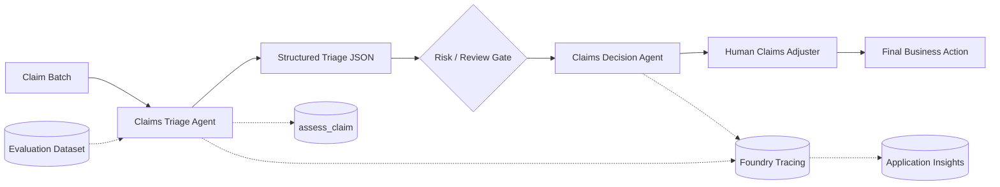

# ClaimSight

**Multi-agent insurance claims decision-support system built with Microsoft Foundry.**

ClaimSight triages property and auto claims, identifies risk indicators, routes flagged cases, and generates evidence-based recommendations for human claims adjusters.

> **Decision support only:** final claim decisions remain with an authorized human.

## Architecture



### Agent responsibilities

| Agent | Responsibility |
|---|---|
| **Claims Triage Agent** | Evidence extraction, threshold checks, missing-document detection, risk classification |
| **Claims Decision Agent** | Consumes triage JSON and produces an evidence-based recommendation |

## Tech Stack

| Layer | Stack |
|---|---|
| AI platform | **Microsoft Foundry / Foundry Agent Service** |
| Model | **GPT-4.1-mini** |
| Language | **Python 3.10+** |
| SDK | **Azure AI Projects SDK**, Azure Identity |
| Agent tools | **Foundry FunctionTool** / `assess_claim` |
| API | **OpenAI Responses API / Conversations API** |
| Observability | **OpenTelemetry**, Azure Monitor, **Application Insights** |
| Evaluation | **Microsoft Foundry Evaluations**, Coherence + Fluency |
| Orchestration | **Foundry Workflow Agent** + Python SDK workflow |
| Data | JSON / JSONL |
| Source control | Git / GitHub / Codespaces |

## Core flow

```text
Claims
  ↓
Triage Agent
  ├─ assess_claim
  ├─ threshold analysis
  └─ evidence + risk
  ↓
Structured JSON
  ↓
Review / routing
  ↓
Decision Agent
  ↓
Recommendation
  ↓
Human Adjuster
```

## Key controls

- Explicit claim thresholds instead of free-form risk judgment
- Structured JSON contract between agents
- Human-in-the-loop escalation for material risk or insufficient evidence
- Evidence-based recommendations; no invented claim or policy facts
- Foundry tracing for model/tool/workflow observability
- Dataset-based evaluation before changes are promoted
- Separate evaluation-safe agent version for portal evaluation where local Python tools are unavailable

## Project structure

```text
claims/
├── challenge-0-setup/       # Azure + Foundry setup
├── challenge-1-build/       # Triage + Decision agents
├── challenge-2-monitor/     # GenAI tracing / Application Insights
├── challenge-3-evaluate/    # Foundry evaluation dataset + eval agent
├── challenge-4-deploy/      # Python + Foundry workflow orchestration
├── knowledge/               # Demo grounding guidance
├── ARCHITECTURE.md
└── EVALUATION_PLAN.md
```

## Run

### 1. Build agents

```bash
cd claims/challenge-1-build
python agents.py
```

### 2. Enable monitoring

```bash
cd claims/challenge-2-monitor
python monitor.py
```

### 3. Run evaluation

Use **Microsoft Foundry → Build → Evaluations** with:

- Target: `claims-triage-agent`
- Scope: Individual turns
- Dataset: `claims/challenge-3-evaluate/eval_portal.jsonl`
- Evaluators: Coherence, Fluency

### 4. Run production workflow

```bash
cd claims/challenge-4-deploy
python deploy.py
```

This runs the pipeline:

```text
Triage → validate → route → Decision → report
```

## Validation

The completed build includes:

- ✅ Two persistent Foundry agents
- ✅ GenAI tracing + Application Insights instrumentation
- ✅ 10-case Foundry evaluation
- ✅ Foundry workflow: `claims-processing-workflow`
- ✅ End-to-end Python orchestration
- ✅ Human-review controls and structured agent handoff

The latest successful evaluation run recorded **100% overall**, with **10/10 Coherence** and **10/10 Fluency** across the 10 test cases.

## Documentation

- [Claims scenario](./claims/README.md)
- [Architecture & engineering notes](./claims/ARCHITECTURE.md)
- [Evaluation plan](./claims/EVALUATION_PLAN.md)
- [Demo grounding guidance](./claims/knowledge/CLAIMSIGHT_DEMO_GUIDANCE.md)
- [Microsoft Foundry](https://learn.microsoft.com/azure/foundry/)
- [Foundry Agent Service](https://learn.microsoft.com/azure/foundry/agents/overview)
- [Foundry evaluation](https://learn.microsoft.com/azure/foundry/how-to/evaluate-generative-ai-app)

## Project status

**Build → Monitor → Evaluate → Orchestrate/Deploy: Complete.**
